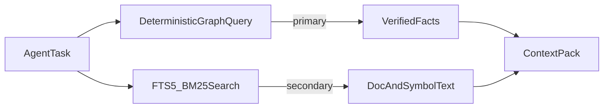
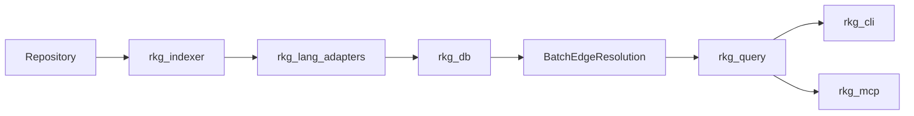
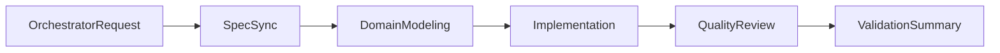

<!--
Preview and export:

  npx @marp-team/marp-cli --no-stdin docs/presentations/rkg-intro.md -p
  npx @marp-team/marp-cli --no-stdin docs/presentations/rkg-intro.md --pdf
  npx @marp-team/marp-cli --no-stdin docs/presentations/rkg-intro.md --html

  PDF export requires a local Chrome/Chromium install (Puppeteer).
-->

---
marp: true
theme: default
paginate: true
header: 'repo-k-graph (rkg)'
footer: 'Deterministic Repository Intelligence'
style: |
  section { font-size: 28px; }
  code { font-size: 22px; }
  section.lead h1 { text-align: center; }
  section.lead p { text-align: center; }
  table { font-size: 24px; }
---

<!-- _class: lead -->
<!-- _paginate: false -->

# repo-k-graph (rkg)

**Deterministic repository knowledge graphs and context infrastructure for AI-assisted software engineering**

Release `1.0.12` · Sae-Hwan Park · 2026

---

# Agenda

1. **The problem** — why agents keep rediscovering repos
2. **Insights & design tastes** — structure-first, local-first, provenance-first
3. **Architecture** — pipeline, crates, domain model
4. **Implementation** — indexing, resolution, query, MCP
5. **Software engineering** — spec-driven delivery, quality gates, agent harness
6. **Status & vision** — what shipped, what's next

---

<!-- notes: Open with a relatable scenario: an agent asked to change a validation function spends thousands of tokens grepping and reading files before making a single edit. -->

# The agent workflow today

LLM coding agents navigate large repositories through:

- Token-heavy prompting and context stuffing
- Heuristic semantic / vector search
- Ad hoc `grep`, file reads, and directory walks
- Repeated re-inference of structure on every task

**Result:** expensive, slow, and inconsistent grounding.

---

# What agents keep rediscovering

Example: modify a validation pipeline. The agent may need:

- Upstream **callers**
- Downstream **impacts**
- Associated **tests** and **fixtures**
- Related **config** and **types**
- Nearby **documentation**
- Historical **ownership** and co-change patterns

Today these relationships are **re-inferred** on every task.

---

# Symptoms, not causes

| Symptom | Root cause |
|---------|------------|
| Excessive token consumption | No precomputed structure |
| Hallucinated APIs and symbols | Probabilistic retrieval |
| Weak cross-file reasoning | Chunk-oriented context |
| Inconsistent retrieval quality | Heuristic relevance |
| Incorrect file modifications | Missing dependency graph |

Existing tools (LSP, embeddings, grep) help — but don't provide **verified structural intelligence**.

---

# Latent structure already exists

Repositories already contain rich latent structure:

- Call and import graphs
- Type and inheritance relationships
- Documentation linkage
- Test associations
- Git evolution and co-change patterns

**Opportunity:** formalize this into a deterministic intelligence layer.

---

<!-- notes: This is the thesis slide. Pause on the quote — it distinguishes rkg from "another search tool." -->

# The gap

> repo-k-graph (rkg) addresses a foundational bottleneck in AI-assisted software engineering: **the absence of deterministic, structured repository intelligence.**

Rather than replacing semantic reasoning, rkg enables:

> **Deterministic retrieval first, semantic reasoning second.**

---

# What rkg is

**One-liner:** A Rust workspace that builds a local repository knowledge graph and exposes deterministic query interfaces via CLI and MCP.

```text
rkg = facts, graph, provenance, precise context
AI agent = interpretation, planning, code generation
```

Separate **deterministic retrieval** from **semantic reasoning**.

---

<!-- _class: lead -->

# Part II

## Insights & Design Tastes

---

# Innovation table

| Existing systems | rkg |
|------------------|-----|
| Semantic retrieval | **Deterministic graph retrieval** |
| Embedding-first | **Structure-first** |
| Chunk-oriented | **Symbol-oriented** |
| Heuristic relevance | **Verified relationships** |
| Agent-driven exploration | **Precomputed intelligence** |
| Mostly textual | **Structural + semantic hybrid** |

<!-- notes: Walk the table row by row. The key shift is from "find something relevant" to "return verified facts about symbols and edges." -->

---

# Hybrid retrieval model



- **Primary:** graph traversal, symbol lookup, impact analysis
- **Secondary:** FTS5 full-text search with BM25 ranking (`rkg search`, `rkg doc-search`)

---

# Local-first intelligence

- Embedded **SQLite** knowledge store at `./.rkg/rkg.db`
- No external graph database required
- Edge tables over dedicated graph DB — simpler ops, portable artifacts
- Runs entirely on the developer machine or CI runner

**Design taste:** optimize for **local, reproducible, agent-adjacent** workflows.

---

# Facts vs reasoning boundary

| Layer | Responsibility |
|-------|----------------|
| `rkg-core` | Pure domain types — **zero I/O deps** |
| `rkg-db` / `rkg-indexer` | Persistence and ingestion |
| `rkg-query` | Deterministic query logic |
| `rkg-cli` / `rkg-mcp` | Thin transport surfaces |
| **AI agent** | Interpretation, planning, code generation |

Agents consume **verified structure**; they don't re-derive it.

---

# Provenance-first context

Context packs include:

- **Line-span citations** (file, start/end line)
- Symbol definitions with qualified names
- Related edges, tests, and doc blocks
- **Token budgets** — trim to fit agent context windows

Not opaque chunks — **structured, citable, budgeted** context.

```bash
rkg context validate_patient --budget 2000
```

---

# Determinism as a product feature

- **Sorted** traversal and file ordering
- **Content-hash** incremental diff (SHA-256)
- **Idempotent** schema bootstrap
- **Stable** query output for the same graph state

Determinism enables reproducible agent workflows and trustworthy benchmarks.

---

# Design risks & mitigations

| Risk | Mitigation |
|------|------------|
| Dynamic / reflective calls | Partial static analysis + heuristics + confidence scores |
| Large repositories | Incremental indexing; changed/unchanged/deleted diff |
| Graph explosion on traversal | Bounded depth; scoped edge kinds |
| Agent over-reliance on incomplete graph | Provenance output; unresolved edge tracking |
| Language diversity | Per-language Tree-sitter adapters |

---

<!-- _class: lead -->

# Part III

## Architecture

---

<!-- _class: lead -->
<!-- fit -->

<!-- notes: Walk top-to-bottom. Emphasize the fork at the bottom — same query engine serves humans and agents. -->

# End-to-end pipeline

```text
┌─────────────────────────────────────────────────────────────┐
│                      Project Repository                     │
│  source code · tests · docs · config · notebooks · git      │
└──────────────────────────────┬──────────────────────────────┘
                               ▼
┌─────────────────────────────────────────────────────────────┐
│  Ingestion → Language Adapters → Fact Extraction            │
└──────────────────────────────┬──────────────────────────────┘
                               ▼
┌─────────────────────────────────────────────────────────────┐
│  Knowledge Store (SQLite + FTS5) → Query Engine             │
└───────────────┬───────────────────────────────┬─────────────┘
                ▼                               ▼
         CLI Layer (rkg)                  MCP Server (rkg mcp serve)
                ▼                               ▼
         Human Developer                   Coding Agents
```

---

# Six logical layers

1. **Ingestion** — walker, ignore rules, git reader
2. **Language adapters** — Tree-sitter per language
3. **Fact extraction** — nodes (symbols, docs, tests) + edges
4. **Knowledge store** — SQLite graph tables + FTS5
5. **Query engine** — traversal, impact, context packing
6. **Interfaces** — CLI (human/scriptable) + MCP (agents)

Each layer has a clear input/output contract.

---

# Crate map

| Crate | Role |
|-------|------|
| `rkg-core` | Shared domain types |
| `rkg-indexer` | Discovery, incremental diff, git/manifests |
| `rkg-db` | SQLite schema, CRUD, edge resolution |
| `rkg-query` | Traversal, impact, context, co-change |
| `rkg-cli` | CLI binary + indexing orchestration |
| `rkg-mcp` | MCP stdio server, 8 tools |
| `rkg-lang-*` | Python, Rust, F#, Mojo, Kotlin, Swift adapters |

13-member workspace · Rust edition 2024

---

# Domain model — core types

```rust
pub struct File {
  pub path: String,
  pub language: Option<String>,
  pub hash: Option<String>,
  pub line_count: Option<usize>,
}

pub struct Symbol {
  pub name: String,
  pub qualified_name: String,
  pub kind: SymbolKind,
  pub location: Location,
}
```

Every fact traces back to a **file location**.

---

# Domain model — edges

```rust
pub enum EdgeKind {
  Imports, Calls, Defines, Implements, Extends,
  ReferencesType, TestedBy, DocumentedBy,
  ConfiguredBy, ModifiedWith, Spawns, SendsTo,
}

pub struct ContextPack {
  pub target: Option<String>,
  pub files: Vec<File>,
  pub symbols: Vec<Symbol>,
  pub edges: Vec<Edge>,
  pub docs: Vec<DocBlock>,
  pub tests: Vec<TestCase>,
  pub token_budget: Option<usize>,
}
```

Rich edge taxonomy beyond imports and calls.

---

# Data flow — index path



1. Discover files → 2. Extract facts → 3. Store in SQLite
4. Batch-resolve unresolved edges → 5. Query → 6. Expose via CLI/MCP

---

# Index pipeline (7 steps)

1. Detect repo root (`.git` ancestor)
2. Discover files; classify **changed / unchanged / deleted**
3. Per changed file: language adapter extraction → persist
4. Load workspace metadata (Cargo, Gradle, SPM, …)
5. **Post-index resolution** — edges, test linkages, doc linkages
6. Git history indexing
7. Report via `IndexRunSummary`

Orchestrated by `rkg index` in `rkg-cli`.

---

# Two surfaces, one query layer

```text
rkg-cli ──┐
          ├──► rkg-query ──► rkg-db
rkg-mcp ──┘
```

**Constraint:** CLI and MCP must **not duplicate** query logic.

Both are thin interfaces over the same deterministic `rkg-query` APIs.

---

# Human + agent consumers

| Consumer | Interface | Example |
|----------|-----------|---------|
| Human developer | CLI | `rkg callers validate_patient` |
| Human developer | CLI | `rkg impact foo --depth 2` |
| Coding agent | MCP | `get_context_pack({ symbol, budget })` |
| Coding agent | MCP | `get_impact_analysis({ name, depth })` |

Supported agent clients: Codex, Claude Code, ForgeCode, AntiGravity CLI, and custom MCP workflows.

---

# Tech stack

| Component | Choice |
|-----------|--------|
| Language | **Rust** (performance, portability, reliability) |
| Parsing | **Tree-sitter** per language |
| Storage | **SQLite** + **FTS5** (BM25) |
| VCS | **git2** |
| CLI | **clap** |
| Agent protocol | **MCP** stdio JSON-RPC 2.0 |
| Serialization | **serde** at transport boundaries |

---

<!-- _class: lead -->

# Part IV

## Implementation Deep-Dives

---

# Incremental indexing

Files classified by **SHA-256 content hash**:

```rust
pub struct IncrementalDiff {
  pub changed: Vec<DiscoveredFile>,
  pub unchanged: Vec<DiscoveredFile>,
  pub deleted: Vec<ExistingFileSnapshot>,
}
```

- Only **changed** files re-parsed on `rkg index`
- `--force` reindexes everything
- Deterministic sort order on all diff buckets

---

# Language adapter pattern

Tree-sitter parse → AST walk → domain types → persist:

```rust
fn parse_to_tree(source: &str) -> Result<tree_sitter::Tree, PythonParseError> {
  let mut parser = Parser::new();
  parser.set_language(&tree_sitter_python::LANGUAGE.into())?;
  parser.parse(source, None).ok_or(PythonParseError::ParseCancelled)
}
```

Each `rkg-lang-*` crate extracts symbols, imports, calls, types, tests, and framework facts.

See `docs/language-adapter-guide.md` for extension workflow.

---

# Two-phase edge resolution

**Phase 1 (extract):** store edges with `unresolved_target` when symbol ID unknown.

**Phase 2 (post-index):** batch-resolve against full symbol table:

```rust
pub fn resolve_unresolved_edges(
  connection: &Connection,
  repository_id: i64,
) -> Result<usize> {
  // SELECT edges WHERE target_symbol_id IS NULL
  // Match by qualified_name, then fallback heuristics
  // ...
}
```

<!-- notes: Common question: why two phases? Because cross-file references can't always be resolved until all symbols are indexed. Batch resolution after the full pass yields higher match rates. -->

---

<!-- notes: Highlight max_depth — this is how we prevent graph explosion on large codebases. -->

# Bounded BFS traversal

```rust
pub fn traverse_relationships(
  connection: &Connection,
  repository_id: i64,
  start_symbol_ids: &[i64],
  edge_kinds: &[&str],
  direction: TraversalDirection,
  max_depth: usize,
) -> rusqlite::Result<TraversalResult>
```

- Forward and backward directions
- Configurable edge kinds and depth limit
- Visited set prevents cycles; output sorted for determinism

---

# Impact analysis

`analyze_impact` combines:

- **Downstream** traversal (what does this symbol affect?)
- **Upstream** traversal (what depends on this symbol?)
- Associated **tests** and **documentation**
- Depth-limited blast radius

```bash
rkg impact validate_patient --depth 2
```

Edge kinds include `Calls`, `Imports`, `ReferencesType`, `ModifiedWith`, `Spawns`, `SendsTo`.

---

# Context packing

`pack_context` assembles a token-budgeted `ContextPack`:

- Target symbol + related symbols
- Traversed edges within depth budget
- Linked tests and doc blocks
- Output as **Markdown** or **JSON**

```bash
rkg index
rkg context validate_patient --budget 2000
```

<!-- notes: Live demo script: run index on a sample repo, then impact and context commands. Show JSON output with line citations. -->

---

# MCP server

- **Transport:** stdio JSON-RPC 2.0
- **Protocol on stdout;** diagnostics on stderr
- **8 tools** wired to `rkg-query`:

`find_symbol` · `get_symbol` · `get_callers` · `get_callees`
`get_docs` · `get_tests` · `get_impact_analysis` · `get_context_pack`

```bash
rkg mcp serve
```

Transcript smoke tests validate real agent client compatibility.

---

# Multi-language breadth

| Language | Depth highlights |
|----------|------------------|
| **Python** | Deepest — FastAPI, Flask, Pydantic, pytest, Jupyter, pipelines |
| **Rust** | Cargo workspaces, macros, Tokio, Axum/Actix, unsafe/FFI |
| **F#** | Giraffe/Saturn routes, xUnit/NUnit/Expecto |
| **Mojo** | Python interop, test discovery |
| **Kotlin** | Ktor, Flow topology, Android linkage, KSP provenance |
| **Swift** | SPM, SwiftUI/UIKit, concurrency, macro depth |

Versioning: Python = `1.0.0` baseline; each language +0.0.1 patch.

---

# Framework intelligence

Beyond bare symbols — framework-aware facts:

- **Python:** FastAPI routes, Flask blueprints, Pydantic models
- **Rust:** Axum/Actix routes, Tokio spawn/channel/select topology
- **Kotlin:** Ktor routes, Android components/resources from manifests
- **Swift:** SwiftUI bindings, `#Preview` macros, storyboard references
- **All:** Concurrency topology (`Spawns`, `SendsTo` edges)

One graph, many ecosystem-specific node types.

---

# Git intelligence

Phase 10 capabilities:

- Commit history parsing per file/symbol
- **Churn** metrics and author frequency
- **Co-change** graph — symbols/files frequently modified together

```bash
rkg git src/module.py
rkg cochange validate_patient
```

Surfaces ownership signals agents can't infer from static analysis alone.

---

# Evaluation (Phase 17)

Reproducible agent task benchmarks:

- **18 tasks** in `fixtures/benchmarks/`
- **Naive grep baseline** simulator for comparison
- Scoring metrics: token usage, file precision, task success

```bash
rkg bench
```

Network-isolated fixtures ensure deterministic evaluation.

---

<!-- _class: lead -->

# Part V

## How We Built It

---

# Spec-driven development

Three **truth documents** stay aligned with implementation:

| Document | Purpose |
|----------|---------|
| `SPEC.md` | Phase history, present/future state |
| `ARCHITECTURE.md` | Verified crate boundaries, data flow |
| `CHANGELOG.md` | Release-level feature narrative |

Intent docs (`docs/project-proposal.md`, `docs/dev-roadmap.md`) complement but don't override truth docs.

<!-- notes: Why three docs? SPEC tracks what exists, ARCHITECTURE tracks how it's structured, CHANGELOG tracks what changed for users. Agents and contributors can verify state without guessing. -->

---

# Phased delivery

**Phases 0–17 complete** — no further roadmap phases planned.

| Phase band | Capability |
|------------|------------|
| 0–2 | Foundation, SQLite store, ingestion |
| 3–6 | Python symbols, relationships, tests, docs |
| 7–9 | Query engine, context packing, MCP |
| 10–11 | Git intelligence, Python frameworks |
| 12–16 | Multi-language + ecosystem depth |
| 17–18 | Benchmarking, packaging, distribution |

Delivered far beyond the original 8-month proposal scope.

---

# Crate boundaries as enforcement

Architecture constraints encoded in crate graph:

- `rkg-core` — **no** persistence, CLI, or MCP dependencies
- `rkg-query` — shared by CLI and MCP; single source of query truth
- `rkg-lang-*` — isolated per language; add languages without touching query layer
- Small typed crates over a monolith

**Crate boundaries = architecture documentation that compiles.**

---

# Code quality tastes

From `docs/best-practices.md`:

**DRY parser setup** — one `parse_to_tree` helper per language adapter

**Idiomatic iterators** — `rows.collect::<Result<Vec<_>, _>>()?` over manual push loops

**SRP decomposition** — `run_index` orchestrator reads like a table of contents; helpers per extraction concern

**Guard clauses** — early returns over deep nesting

---

# Verification gate

Every change must pass:

```sh
cargo fmt --all -- --check
cargo clippy --workspace --all-targets -- -D warnings
cargo test --workspace
```

Enforced in `.github/workflows/ci.yml` — clippy warnings are **errors**.

2-space indentation · idiomatic Rust · meaningful tests only

---

# Testing strategy

Three layers:

1. **Unit tests** — in-crate `#[cfg(test)]` modules
2. **CLI integration tests** — 54 tests under `crates/rkg-cli/tests/` using `assert_cmd` + temp git repos
3. **MCP smoke tests** — process-level transcript replay against real JSON-RPC fixtures

Language and DB behavior validated **end-to-end**, not mocked.

---

# Agent harness (meta)

rkg dogfoods agent workflows for its own development:



Pipeline + QA gate with deterministic handoffs in `_workspace/`.
Skills: `rkg-orchestrator`, `rkg-spec-sync`, `rkg-domain-modeling`, `rkg-quality-review`.

<!-- notes: Meta narrative: we built infrastructure for agents to understand repos, and we use agent harnesses to build that infrastructure. The harness spec lives in docs/harness/rkg/team-spec.md. -->

---

<!-- _class: lead -->

# Part VI

## Status, Vision & Close

---

# What shipped (1.0.12)

Grouped capabilities at current release:

- **Core:** incremental indexing, SQLite graph, FTS5 search
- **Query:** traversal, impact, context packing, co-change
- **Agent:** MCP server with 8 tools, transcript smoke coverage
- **Languages:** Python, Rust, F#, Mojo, Kotlin, Swift
- **Ecosystem:** FastAPI, Cargo, Ktor, Android, SwiftUI, and more
- **Eval:** `rkg bench` with grep baseline
- **Distribution:** GitHub releases, shell completions, schema/adapter docs

---

# MCP tool surface

| Tool | Purpose |
|------|---------|
| `find_symbol` | Search symbols by name (exact or fuzzy) |
| `get_symbol` | Definition + code snippet by qualified name |
| `get_callers` | Upstream call relationships |
| `get_callees` | Downstream call relationships |
| `get_docs` | Documentation for a symbol |
| `get_tests` | Test cases linked to a symbol |
| `get_impact_analysis` | Bounded upstream/downstream blast radius |
| `get_context_pack` | Token-budgeted provenance-rich context |

All tools delegate to `rkg-query` — same logic as CLI.

---

# Long-term vision

Potential evolution (aspirational, not roadmap):

- **Repository OS** for AI agents
- **Persistent repository memory** layer
- **Agent collaboration** substrate
- CI-aware graph evolution
- Multi-repository **organizational graphs**
- IDE integrations and semantic change prediction

---

# What's not planned (yet)

`SPEC.md` §Future: **(None planned at this time)**

Honest scope boundary — Phases 0–17 delivered. Future work awaits new requirements, not a pre-committed backlog.

The foundation is complete; extension points (language adapters, MCP tools) remain open.

---

# Resources

| Document | Path |
|----------|------|
| User manual | `docs/user-manual.md` |
| Schema reference | `docs/schema-reference.md` |
| Language adapter guide | `docs/language-adapter-guide.md` |
| Architecture (Marp) | `docs/architecture.md` |
| Project proposal | `docs/project-proposal.md` |
| Agent harness spec | `docs/harness/rkg/team-spec.md` |
| Development guide | `AGENTS.md` |

GitHub releases include cross-platform binaries and shell completions.

---

<!-- _class: lead -->
<!-- _paginate: false -->

# Thank you

**repo-k-graph (rkg)**

Deterministic repository intelligence for AI-assisted software engineering

Questions?

Try it: `cargo run -p rkg-cli -- index && cargo run -p rkg-cli -- context <symbol> --budget 2000`
